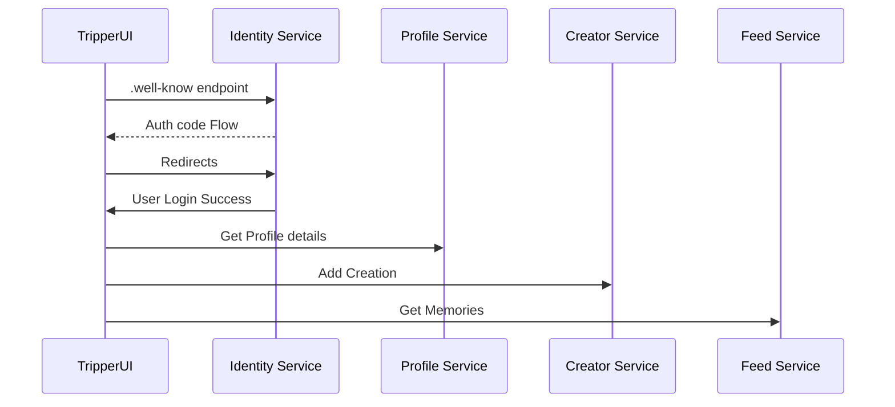

# Trip

##### A microservices based approach for a scalable architecture.(_This project is a skeleton for experimental purpose._)

[](https://travis-ci.org/joemccann/dillinger) 


This is full stack solution using .Net Technologies.

>A user can upload a photo, video the video and photos thumbnails would be generated and the user can later browser his photos and can share them with friends.


# Design

One of the best approach to build software systems


### Entities:
These are the enterprise business objects of your application. These should not be affected by any change external to them, and these should be the most stable code within your application.

### Use Cases:
Implement and encapsulate all of the business rules.

### Interface Adapters:
Convert and present data to the use case and entity layers.

### Frameworks and Drivers:
Contain any frameworks or tools you need to run your application.

### The key concepts here are:
Any layer can only reference a layer below it and know nothing about what’s going on above. The use cases and entities are the heart of your application and should have a minimal set of external library dependencies.

### Events 
The Vents are sgregated based on two types Domain Events and IntegrationEvents


# Gateway

Soon...


# Backend
The backend is built using .net5 

We are trying to sperate individual domain in the complete work flow and we corrently have four major sevices

|                |HTTP              |HTTPS    |
|----------------|------------------|---------|
|Identity Service|`5000`            |`5443`   |
|Profile Service |`6000`            |`6443`   |
|Creator Service |`7000`            |`7443`   |
|Feeder Service  |`8000`            |`8443`   |


### Identity Service (Identity Server 4)
This service is built using Identity server 4 and have uses SQLite for the Database and is built using a code first approach.
<details>
<summary>WellKnown Endpoint Exposed by identity server : https://localhost:5443/.well-known/openid-configuration</summary>
<pre>
{
  "issuer": "https://localhost:5443",
  "jwks_uri": "https://localhost:5443/.well-known/openid-configuration/jwks",
  "authorization_endpoint": "https://localhost:5443/connect/authorize",
  "token_endpoint": "https://localhost:5443/connect/token",
  "userinfo_endpoint": "https://localhost:5443/connect/userinfo",
  "end_session_endpoint": "https://localhost:5443/connect/endsession",
  "check_session_iframe": "https://localhost:5443/connect/checksession",
  "revocation_endpoint": "https://localhost:5443/connect/revocation",
  "introspection_endpoint": "https://localhost:5443/connect/introspect",
  "device_authorization_endpoint": "https://localhost:5443/connect/deviceauthorization",
  "frontchannel_logout_supported": true,
  "frontchannel_logout_session_supported": true,
  "backchannel_logout_supported": true,
  "backchannel_logout_session_supported": true,
  "scopes_supported": [
    "profile",
    "openid",
    "role",
    "tripfeed.write",
    "tripfeed.read",
    "offline_access"
  ],
  "claims_supported": [
    "gender",
    "website",
    "picture",
    "profile",
    "preferred_username",
    "nickname",
    "middle_name",
    "given_name",
    "family_name",
    "name",
    "birthdate",
    "zoneinfo",
    "locale",
    "updated_at",
    "sub",
    "role"
  ],
  "grant_types_supported": [
    "authorization_code",
    "client_credentials",
    "refresh_token",
    "implicit",
    "password",
    "urn:ietf:params:oauth:grant-type:device_code"
  ],
  "response_types_supported": [
    "code",
    "token",
    "id_token",
    "id_token token",
    "code id_token",
    "code token",
    "code id_token token"
  ],
  "response_modes_supported": [
    "form_post",
    "query",
    "fragment"
  ],
  "token_endpoint_auth_methods_supported": [
    "client_secret_basic",
    "client_secret_post"
  ],
  "id_token_signing_alg_values_supported": [
    "RS256"
  ],
  "subject_types_supported": [
    "public"
  ],
  "code_challenge_methods_supported": [
    "plain",
    "S256"
  ],
  "request_parameter_supported": true
}
</pre>
</details>

### Profile Service  
This service is built using .net 5 and have uses SQLite for the Database and is built using a code first approach.

### Creator Service
This service is built using .net 5 and have uses SQLite for the Database and is built using a code first approach.

### Feeder Service
This service is built using .net 5 and have uses Mongo for the Database and is built using a code first approach.


# Frontend
- **Tripper.UI** - `1000` , `1443` - (Experimental) Build on Balzor WebAssembly. Login using oauth2 from identity server 4  using only client id(client secrets cant be manged client side). The App will proive an inter face to upload his creation (images/videos) and he will be able to see it in his post which his friends will also be able to see.

- **idolmaker** - Angular template for ui. Soon...
- **Identity Admin Panel **  - `5000` , `5443`  -Available on the indentity server currently and can be used to add user/roles/clients - few feature still in progress


# Key Features

- The services use a Clean Architecture approach using CQRS
- We have used Serrilog for Logging and can be visible in Serrilog Dashboad.
- The Identity Service has an in build simple Admin Panel to view and edit roles/users.
- The Service exposes an health check endpoint with system resources info.
- The Service also expose metrics for Promethues and can be Integrated With Grafana.
- The service communicates to each other for eventual consitency via MSMQ -> RabbitMQ
- The service communicate also via GRPC for syncronus calls.

# Initial Setup

# Services

### Identity Service

#### Create Migrations 
- Add Migrations
```sh
dotnet ef migrations add InitialCreate -c PersistedGrantDbContext
dotnet ef migrations add InitialCreate -c ConfigurationDbContext
dotnet ef migrations add InitialCreate -c ApplicationDbContext
```

- Update Database
```sh
dotnet ef database update -c  PersistedGrantDbContext
dotnet ef database update -c  ConfigurationDbContext
dotnet ef database update -c  ApplicationDbContext
```

```sh
dotnet run /seed
```

## Profile Service
- Add Migrations

```sh
dotnet ef migrations add InitialCreate -c ProfileWriterDbContext
dotnet ef migrations add InitialCreate -c ProfileReaderDbContext
```

- Update Database
```sh
dotnet ef database update -c ProfileReaderDbContext
```


## Creator Service
- Add Migrations
```sh
dotnet ef migrations add InitialCreate -c CreatorWriterDbContext
dotnet ef migrations add InitialCreate -c CreatorReaderDbContext
```

- Update Database
```sh
dotnet ef database update -c CreatorReaderDbContext
```

## Feeds Service

This service is using mongodb and dont require Migrations.`27017`

## Identity Auth Flow


# Docker File Settings

```sh
docker build -t trip-Identity -f Trip.Identity.Dockerfile .   

docker build -t trip-Creator -f Trip.Creator.Dockerfile .   

docker build -t trip-Profile -f Trip.Profile.Dockerfile .   

docker build -t trip-Feeds -f Trip.Feeds.Dockerfile .   

Extras :

docker network connect DockerNetwork rabbitmq
```

# Docker Compose Settings

```sh
docker-compose up 

docker-compose up feeds-api


docker exec -ti feeds ifconfig
```

# Docker NEtwork

```sh
docker network create DockerNetwork
docker network connect DockerNetwork rabbitmq
```




