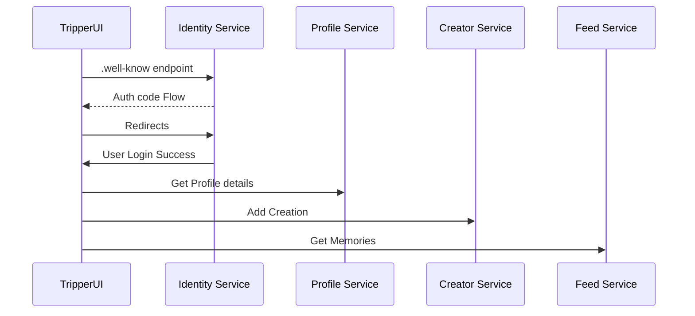
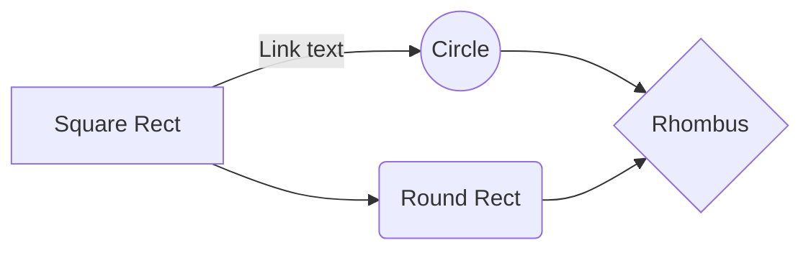

# Trip

##### A microservices based approach for a scalable architecture.(_This project is a skeleton for experimental purpose._)

[](https://travis-ci.org/joemccann/dillinger)

This is full stack solution using .Net Technologies.

>A user can upload a photo, video the video and photos thumbnails would be generated and the user can later browser his photos and can share them with friends.
>

# Design

One of the best approach to build software systems


### Entities:
These are the enterprise business objects of your application. These should not be affected by any change external to them, and these should be the most stable code within your application.

### Use Cases:
Implement and encapsulate all of the business rules.

### Interface Adapters:
Convert and present data to the use case and entity layers.

### Frameworks and Drivers:
Contain any frameworks or tools you need to run your application.

### The key concepts here are:
Any layer can only reference a layer below it and know nothing about what’s going on above. The use cases and entities are the heart of your application and should have a minimal set of external library dependencies.


# Gateway

Soon...


# Backend
The backend is built using .net5 

We are trying to sperate individual domain in the complete work flow and 

- **Identity Service (Identity Server 4)**  - This service is built using Identity server 4 and have uses SQLite for the Database and is built using a code first approach.
- **Profile Service**   This service is built using .net 5 and have uses SQLite for the Database and is built using a code first approach.
- **Creator Service**   This service is built using .net 5 and have uses SQLite for the Database and is built using a code first approach.
- **Feeder Service**  This service is built using .net 5 and have uses SQLite for the Database and is built using a code first approach.


|                |HTTP              |HTTPS    |
|----------------|------------------|---------|
|Identity Service|`5000`            |`5443`   |
|Profile Service |`6000`            |`6443`   |
|Creator Service |`7000`            |`7443`   |
|Feeder Service  |`8000`            |`8443`   |


# Frontend
- **Tripper.UI** - 1000,1443(s)
- **Identity Admin Panel ** 


# Key Features

- The services use a Clean Architecture approach using CQRS
- We have used Serrilog for Logging and can be visible in Serrilog Dashboad.
- The Identity Service has an in build simple Admin Panel to view and edit roles/users.
- The Service exposes an health check endpoint with system resources info.
- The Service also expose metrics for Promethues and can be Integrated With Grafana.
- The service communicates to each other for eventual consitency via MSMQ -> RabbitMQ

# Initial Setup

# Services

### Identity Service

#### Create Migrations 
```sh
dotnet ef migrations add InitialCreate -c PersistedGrantDbContext
dotnet ef migrations add InitialCreate -c ConfigurationDbContext
dotnet ef migrations add InitialCreate -c ApplicationDbContext
```

Update Database
```sh
dotnet ef database update -c  PersistedGrantDbContext
dotnet ef database update -c  ConfigurationDbContext
dotnet ef database update -c  ApplicationDbContext
```

```sh
dotnet run /seed
```

## Profile Service
```sh
dotnet ef migrations add InitialCreate -c ProfileWriterDbContext
dotnet ef migrations add InitialCreate -c ProfileReaderDbContext
```

-Update Database
```sh
dotnet ef database update -c ProfileReaderDbContext
```


## Creator Service
```sh
dotnet ef migrations add InitialCreate -c CreatorWriterDbContext
dotnet ef migrations add InitialCreate -c CreatorReaderDbContext
```

Update Database
```sh
dotnet ef database update -c CreatorReaderDbContext
```

## Identity Auth Flow




And this will produce a flow chart:


